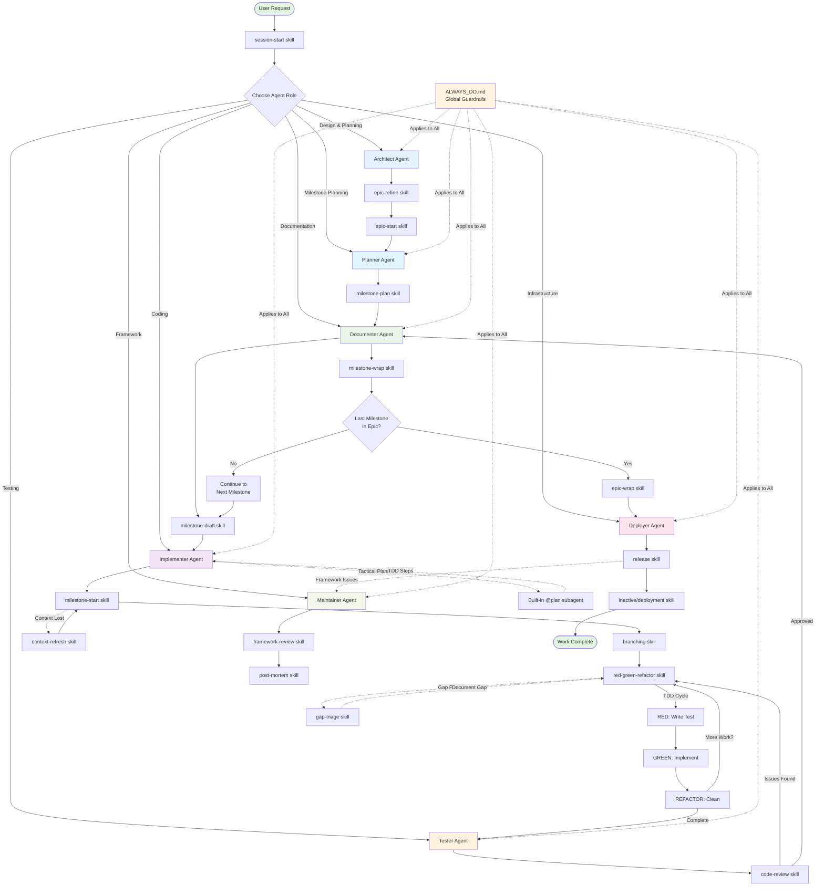

# AI Framework Flowchart

**Purpose:** Visual representation of the AI-assisted development framework structure, showing agents, skills, and workflows.

This flowchart illustrates how the framework components interact during the development lifecycle, from initial planning through deployment.

---

## Framework Overview



---

## Component Descriptions

### Agents (Roles)

The framework defines seven specialized agent roles:

- **Architect** (blue) - System design, epic planning, architectural decisions
- **Planner** (light blue) - Epic decomposition, milestone sequencing
- **Implementer** (purple) - Coding with minimal risk, following TDD
- **Tester** (orange) - Test planning, validation, regression safety
- **Documenter** (green) - Documentation quality, release notes
- **Deployer** (pink) - Infrastructure, packaging, releases
- **Maintainer** (lime) - AI framework evolution, repository infrastructure

### Skills (Workflows)

Skills are reusable procedures that can be invoked by any agent:

**Epic Lifecycle:**
- `epic-refine` - Clarify and validate epic scope
- `epic-start` - Initialize epic structure
- `milestone-plan` - Decompose epic into sequenced milestones *(new)*
- `epic-wrap` - Complete epic, prepare release

**Milestone Lifecycle:**
- `milestone-draft` - Write detailed milestone specifications
- `milestone-start` - Begin milestone implementation
- `milestone-wrap` - Complete milestone, update tracking

**Development:**
- `red-green-refactor` - TDD workflow (RED→GREEN→REFACTOR)
- `code-review` - Review code quality and adherence
- `branching` - Manage git branches

**Infrastructure:**
- `inactive/deployment` - Deploy to environments *(deprecated)*
- `release` - Create versioned releases

**Planning:**
- `roadmap` - Update strategic plans
- `gap-triage` - Handle discovered out-of-scope work

**Maintenance:**
- `context-refresh` - Reload framework state
- `framework-review` - Evaluate framework effectiveness
- `post-mortem` - Analyze workflow failures
- `session-start` - Begin new work session
- `inactive/ui-debug` - Debug UI issues *(deprecated)*

**Built-in Subagents:**
- `@plan` - GitHub Copilot's tactical planning subagent for breaking down implementation steps

### Global Guardrails

**ALWAYS_DO.md** (yellow) applies to all agents and enforces:
- Never commit without human approval
- No time estimates in documentation
- Security & privacy requirements
- Decision logging protocols
- Conflict resolution precedence
- Ownership & handoffs between agents *(new)*
- Gap handling procedures *(new)*

---

## Key Workflows

### 1. Epic Development Flow

```
User Request
  → session-start
  → Architect: epic-refine
  → Architect: epic-start
  → Planner: milestone-plan (decompose epic)
  → Documenter: milestone-draft (for each milestone)
  → [Execute each milestone - see below]
  → Documenter: epic-wrap
  → Deployer: release
```

### 2. Milestone Development Flow

```
milestone-draft
  → Implementer: milestone-start
  → Implementer: branching
  → Implementer: red-green-refactor (TDD cycle)
  → Tester: code-review
  → Documenter: milestone-wrap
```

### 3. TDD Cycle (red-green-refactor)

```
RED: Write failing test
  → GREEN: Implement minimum code to pass
  → REFACTOR: Improve structure
  → [Repeat until feature complete]
```

### 4. Supporting Workflows

- **Gap Discovery:** When work outside scope is found → `gap-triage` → Add to `work/GAPS.md`
- **Context Loss:** If framework context lost → `context-refresh` → Reload state
- **Framework Issues:** After release → `framework-review` → `post-mortem`

---

## Decision Points

The flowchart includes several key decision points:

1. **Choose Agent Role** - Select appropriate agent based on task type
2. **More Work?** - Continue TDD cycle or move to review
3. **Issues Found?** - Return to implementation or approve
4. **Last Milestone in Epic?** - Proceed to epic-wrap or continue to next milestone

---

## Usage

When working with the AI framework:

1. **Start:** Always begin with `session-start` skill to identify the right agent and workflow
2. **Follow:** Let the flowchart guide transitions between agents and skills
3. **Document:** Use tracking docs and implementation logs as you progress
4. **Complete:** Ensure wrap-up skills are executed to maintain framework integrity

---

## Related Documentation

- [Framework README](README.md) - Complete framework documentation
- [ALWAYS_DO](instructions/ALWAYS_DO.md) - Global guardrails
- [Agents](agents/) - Individual agent definitions
- [Skills](skills/) - Detailed skill procedures
