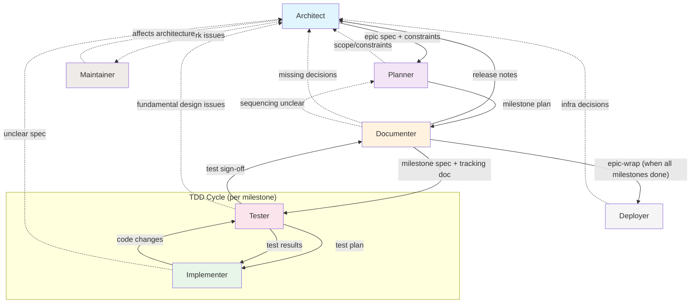

# Agent Handoff Guide

How work flows between agents in the AI-First framework.

---

## Handoff Chain



**Key:** Solid lines = primary flow. Dotted lines = escalation routes.

### Planning Phase

#### Architect → Planner
**Passes:** Epic summary, constraints, non-goals
**Artifact:** `work/epics/<epic-slug>/README.md` (epic spec)

#### Planner → Documenter
**Passes:** Milestone Plan section (IDs, scope, dependencies, order)
**Artifact:** Milestone Plan in `work/epics/<epic-slug>/README.md`

### Per-Milestone Phase

#### Documenter → Tester
**Passes:** Finalized milestone spec + tracking doc
**Artifacts:**
- `work/milestones/<milestone-id>.md` (spec)
- `work/milestones/tracking/<milestone-id>-tracking.md` (tracking doc)

#### Tester → Implementer
**Passes:** Test plan with RED/GREEN/REFACTOR steps
**Artifact:** Test plan section in tracking doc

#### Implementer ↔ Tester (TDD cycle)
The implementer and tester work in a tight loop:
1. **RED:** Tester defines failing test
2. **GREEN:** Implementer writes minimal code to pass
3. **REFACTOR:** Implementer cleans up, tester verifies

This cycle repeats until all acceptance criteria are met.

### Wrap Phase

#### Tester → Documenter
**Passes:** Test sign-off, coverage report
**Artifact:** Updated tracking doc with test results

#### Documenter → Architect (epic-wrap)
**Passes:** Release notes, roadmap updates
**Artifact:** Updated epic spec, `CHANGELOG.md`

#### Documenter → Deployer (when ready)
**Passes:** Release artifacts
**Note:** Deployment happens at epic-wrap or release time, not per-milestone.

## Escalation Routes

Agents escalate *back* when they hit boundaries:

| From | To | When |
|------|----|------|
| Implementer | Architect | Spec is unclear, conflicting, or requires cross-cutting changes |
| Documenter | Architect | Documentation reveals missing architectural decisions |
| Documenter | Planner | Milestone breakdown or sequencing is unclear |
| Planner | Architect | Scope, constraints, or sequencing requires new architectural decisions |
| Tester | Architect | Tests reveal fundamental design issues requiring architectural changes |
| Deployer | Architect | Infrastructure changes affect system architecture |
| Architect | Maintainer | Framework or workflow patterns need improvement |
| Maintainer | Architect | Framework changes affect project architecture patterns |

## Ownership Boundaries

Each agent has a single source of truth:

| Agent | Owns | Does NOT touch |
|-------|------|----------------|
| Architect | `work/epics/**`, epic scope/decisions, merge strategy | Code, tests |
| Planner | Milestone Plan section in epic spec | Milestone specs (that's documenter) |
| Documenter | `work/milestones/**` (specs), `CHANGELOG.md` | Code, tests |
| Implementer | Code + tests + tracking progress in tracking docs | Epic specs, milestone specs |
| Tester | Test plan/coverage in tracking docs, review sign-off | Epic specs, code (except test code) |
| Maintainer | `.ai/**` only (framework) | Project code, project docs |

## Release Sources of Truth

- Milestone spec + tracking doc are authoritative for what shipped
- Epic-wrap summarizes milestone release notes; `CHANGELOG.md` is updated only during epic-wrap
- Release skill tags/publishes only; no doc edits

---

## How Handoffs Work: Copilot vs Claude Code

### GitHub Copilot (VS Code)

Copilot supports multi-agent handoffs natively:

- **Agents** live in `.github/agents/<name>.agent.md`
- **Subagent tool:** `runSubagent` spawns a fresh agent context
- **Handoff flow:** Agent A completes work, uses `runSubagent` to invoke Agent B with a focused context summary
- **Context:** Each subagent starts fresh — only receives the handoff summary, not the full conversation
- **Discovery:** Agents are auto-discovered from `.github/agents/`

**Example:**
```
Architect finishes epic spec
  → runSubagent("planner", "Break this epic into milestones: [summary]")
Planner finishes milestone plan
  → runSubagent("documenter", "Draft spec for milestone M1: [summary]")
```

### Claude Code (CLI/VS Code extension)

Claude Code supports subagents with their own context windows and tool restrictions:

- **Agents** live in `.claude/agents/<name>.md` with YAML frontmatter
- **Subagent delegation:** Claude auto-delegates to agents based on their `description` field when a task matches
- **Handoff flow:** Claude delegates to the matching agent subagent, which runs with its own context, tools, and preloaded skills
- **Context:** Each subagent gets its own context window (isolated from main conversation)
- **Discovery:** Agents are auto-discovered from `.claude/agents/`
- **Skills integration:** Agents preload skills via the `skills:` frontmatter field

**Example:**
```
User: "Help me refine this epic"
  → Claude matches to architect agent (description: "design decisions, system boundaries...")
  → Architect subagent activates with preloaded skills: epic-refine, epic-start, etc.
User: "Draft milestone M1"
  → Claude matches to documenter agent (description: "documentation quality, consistency...")
  → Documenter subagent activates with preloaded skills: milestone-draft, milestone-wrap, etc.
```

### Key Differences

| Aspect | Copilot | Claude Code |
|--------|---------|-------------|
| Agent activation | `runSubagent` tool | Auto-delegation based on `description` |
| Context between agents | Fresh (isolated) | Fresh (isolated) |
| Agent discovery | Auto from `.github/agents/` | Auto from `.claude/agents/` |
| Role enforcement | Enforced by separate context | Enforced by separate context + tool restrictions |
| Skill loading | Implicit (via agent context) | Explicit (`skills:` in agent frontmatter) |
| Handoff artifacts | Passed as subagent input | Returned as summary to main conversation |

### Implications

- **Both platforms** now support real agent isolation — handoff artifacts matter for documentation (tracking docs, specs, roadmaps) regardless of platform.
- **Copilot** uses explicit `runSubagent` calls for handoffs between agents.
- **Claude Code** uses automatic delegation based on task matching, with tool restrictions enforcing role boundaries.

---

**See also:**
- Agent definitions: `.ai/agents/`
- Skills that drive handoffs: `epic-start`, `milestone-draft`, `milestone-start`, `milestone-wrap`, `epic-wrap`
- Project paths: `.ai/instructions/PROJECT_PATHS.md`
